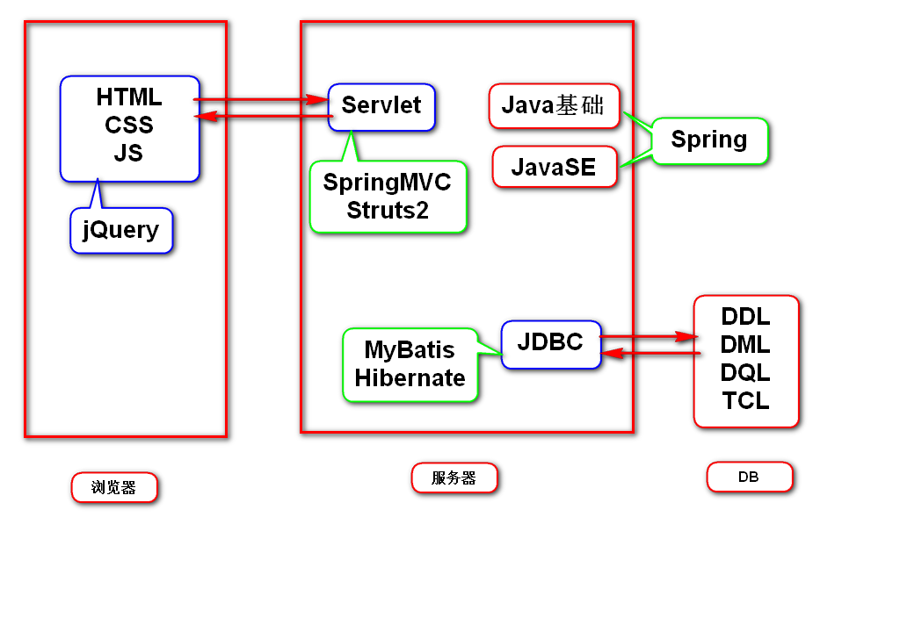
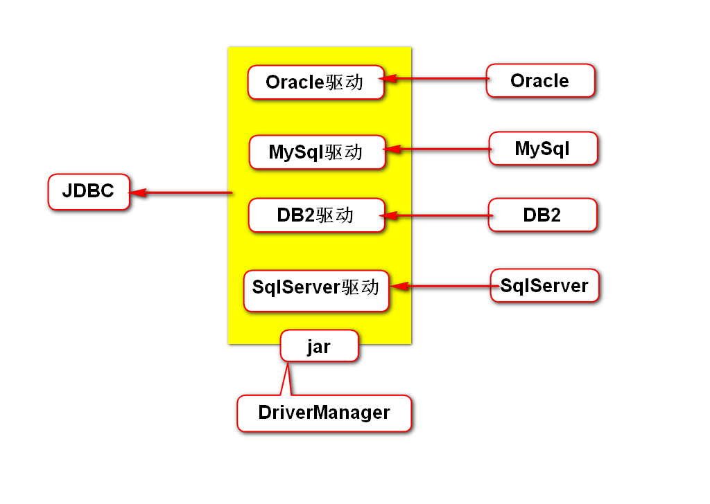
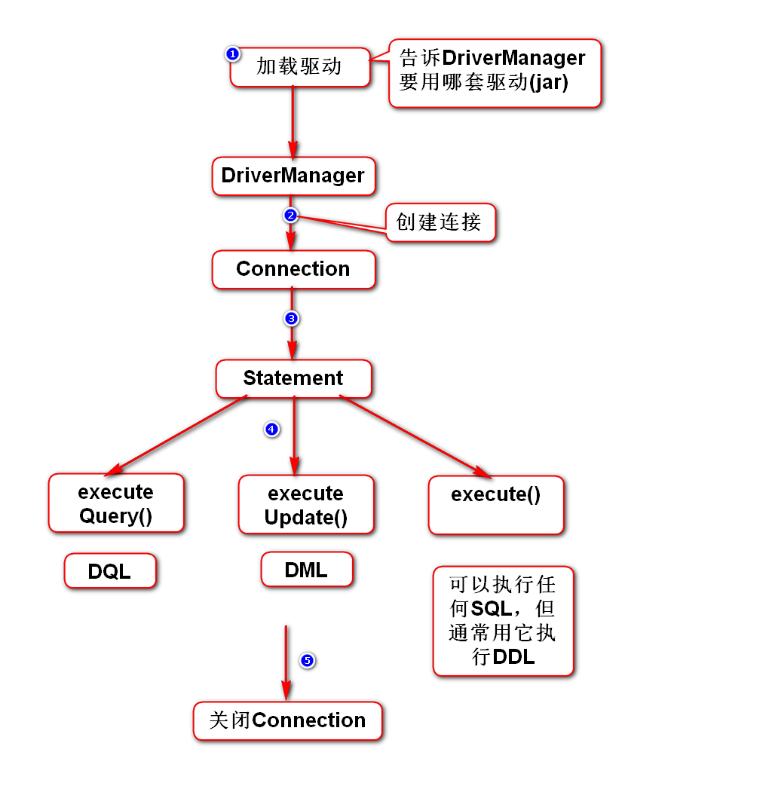
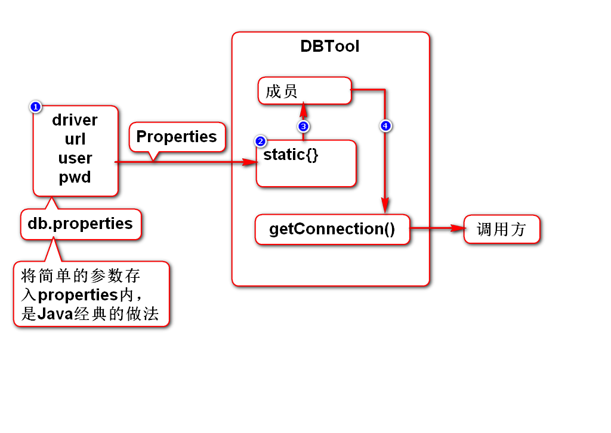
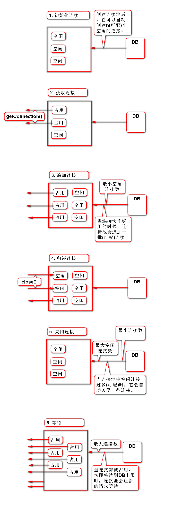
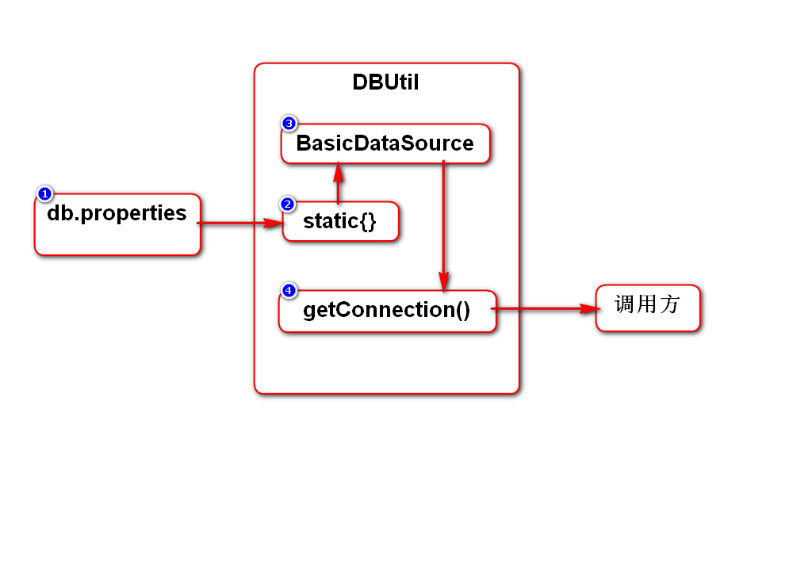

# day01

# Java

# JDBC简介
## 什么是JDBC
Sun推出的用来访问数据库的解决方案

## 要点
### 1.接口
- 只有1套
- Sun规定的统一的接口
- 是我们学习的重点

### 2.实现类
- 多套
- 由数据库厂商实现的
- 有工具可以自动管理他们

# JDBC开发步骤

# DBTool

# 连接池
## 直接使用DriverManager的问题
- 它会无节制的创建连接，当连接数达到上限时，数据库会崩溃；

## 使用连接池可以解决该问题
- 连接池会对连接进行管理和限制，避免达到上限；
- 连接池中的连接可以复用，从而能提高效率；

## 常用的连接池
- DBCP
- C3P0

# DBUtil

